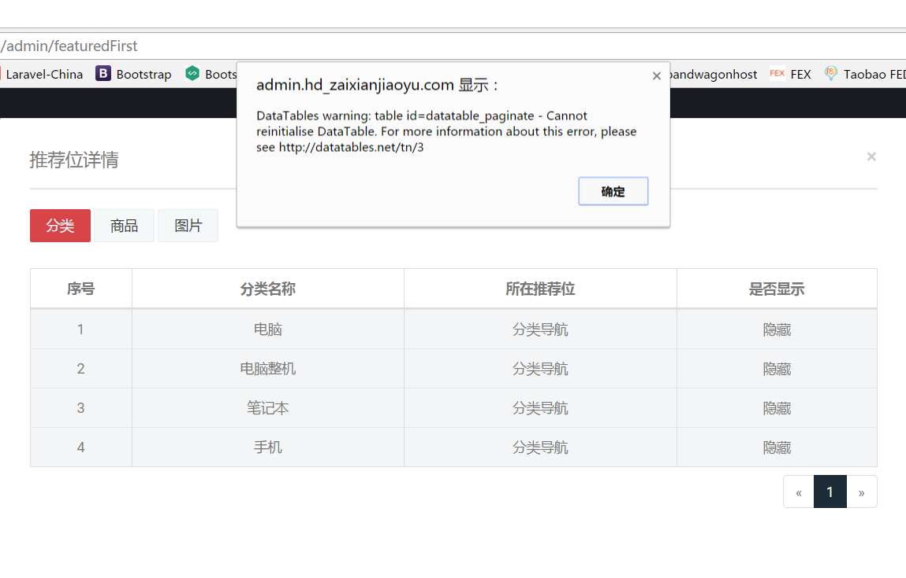

#[Error] 错误积累
	
### Vagrant box add problem

错误信息：
```
An error occurred while downloading the remote file. The error
message, if any, is reproduced below. Please fix this error and try
again.
```

解决办法：
下载并安装vcredist_x86，下载地址：[https://www.microsoft.com/en-US/download/confirmation.aspx?id=8328](https://www.microsoft.com/en-US/download/confirmation.aspx?id=8328)  

参考资料：
>https://laracasts.com/discuss/channels/general-discussion/vagrant-box-add-problem?page=1  


### \u0 字符追加到的Javascript文件 怎么解决呢？ 如下图：


解决方法：nginx 配置文件中加sendfile off

### 清空具有外键约束的表时报ERROR 1701(42000)
```
mysql> truncate roles;
ERROR 1701 (42000): Cannot truncate a table referenced in a foreign key constraint (`laramall`.`permission_role`, CONSTRAINT `permission_role_role_id_foreign` FOREIGN KEY (`role_id`) REFERENCES `laramall`.`roles` (`id`))
```
解决方法： set foreign_key_checks = 0;  清空后再运行 set foreign_key_checks = 1;


### 服务器证书验证失败。CAfile：/etc/ssl/certs/ca-certificates.crt CRLfile：none
参考资料：
>https://stackoverflow.com/questions/21181231/server-certificate-verification-failed-cafile-etc-ssl-certs-ca-certificates-c

解决办法：git config --global http.sslverify false


### 运行 composer install 报"Killed"错误
解决办法：上传 composer.lock 文件到当前项目根目录，再运行 composer install
参考资料：
> https://stackoverflow.com/questions/17818472/composer-update-process-killed/20491886  


### DataTables warning: table id=datatable_paginate - Cannot reinitialise DataTable. For more information about this error, please see http://datatables.net/tn/3



参考资料：
>https://datatables.net/manual/tech-notes/3

解决办法：
```
retrieve: true
```


